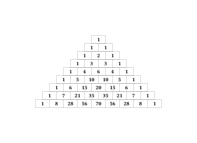

# I have snapped

Years of mathematical study, only to forget the ansatz for a non-homogenous second order Differential Equation.

What's the point?

# Typst

Anyways, TeX has outlived it's [welcome](https://github.com/abaj8494/LaTeX) and I am going to try produce my math notes with [Typst](https://typst.app/)

Herein, lies its beauty:



Compiled with the code
```typst
#set page(
  width: auto,
  height: auto
)

#let pascal_triangle(n, width:28pt, height:16pt) = {
  set text(weight: "bold")
  let row = ()
  let rows = ()
  for r in range(0, n+1) {
    // step the row
    for i in range(row.len() - 1, 0, step: -1) {
      row.at(i) = row.at(i) + row.at(i - 1)
    }
    row.push(1)
    // save the row
    rows.push(
      grid(
        columns: row.len() * (width,),
        rows: height,
        align: center + horizon,
        stroke : 0.2pt,
        ..row.map(str)
      )
    )
  }
  grid(align: center, ..rows)
}
// this is exactly what you want to be writing!
#pascal_triangle(8)
```
