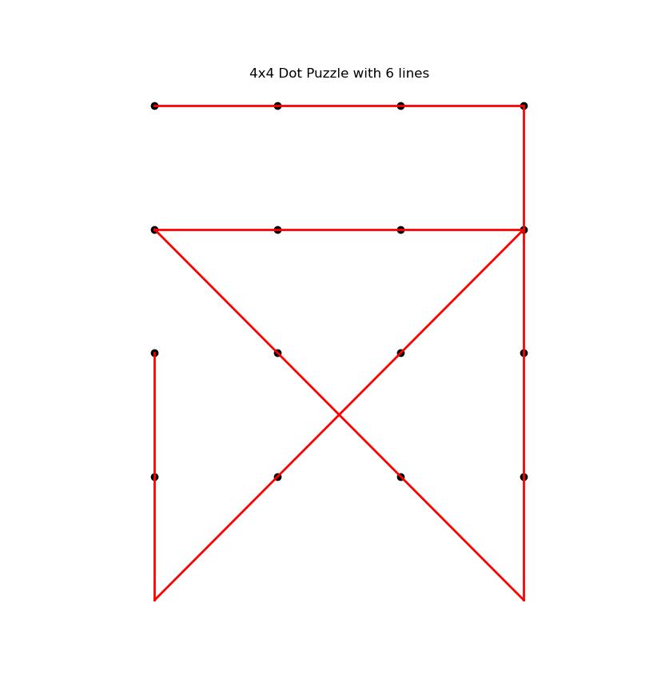
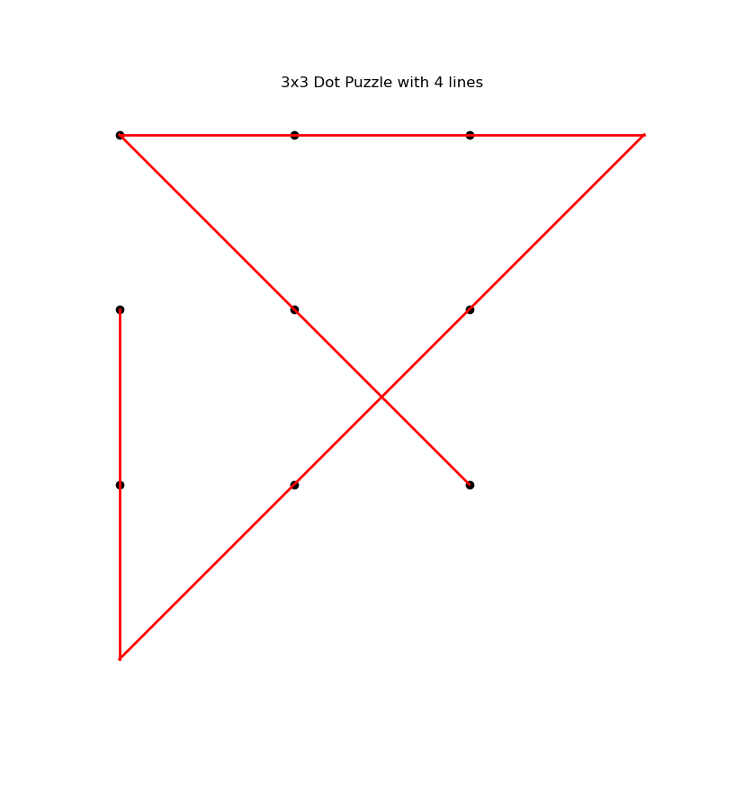

My father brought back a smallish box one day from a business trip. It was the size of a pack of playing cards and within it were 50 puzzles (or thereabouts).

One of the puzzles was "How many pigeons are on all the steps if there is one pigeon on each step, and each step has one more pigeon, and if there are one-hundred steps total?"

Another one of the puzzles was the 9 dot puzzle:

"Draw 4 straight lines connecting all the dots on this grid, without lifting your pen from the page"

I eventually had to turn the card over to see the solution because I could not get it myself!

Anyhow, now that I know some mathematics, and can implement search algorithms, it became possible to solve the 3x3 with backtracking.

also solving  was possible with backtracking.

The combinatoric complexity required a re-implementation with A-star search to solve anything N>=5.
 
